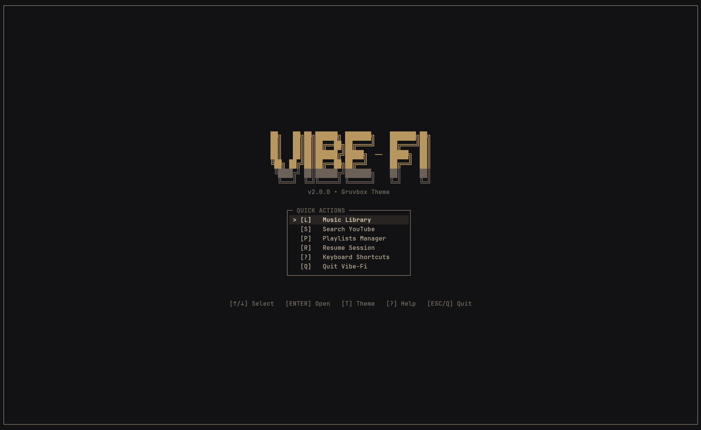
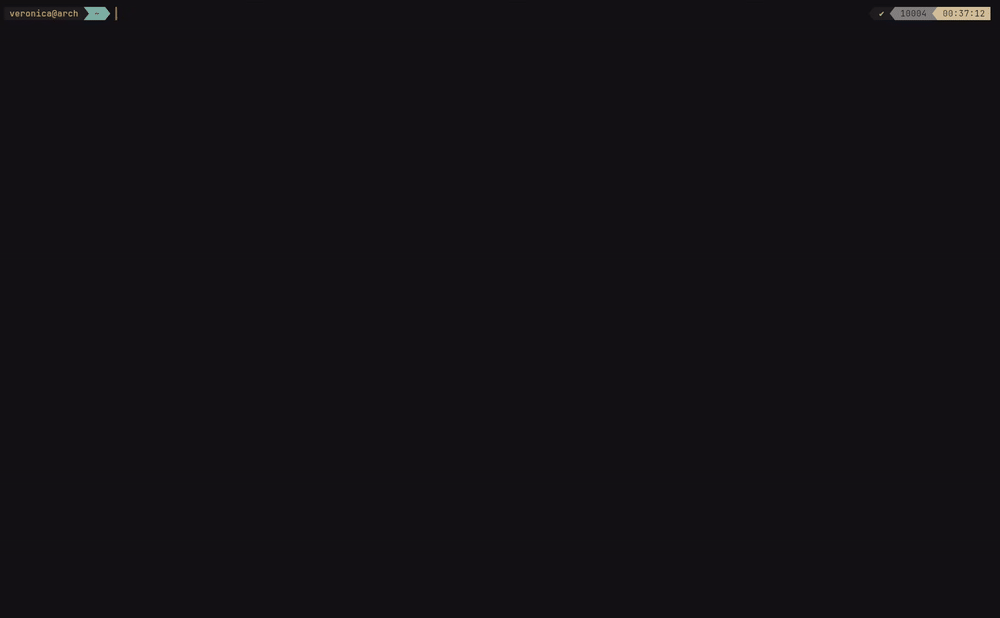

<div align="center">

<br/>

<picture>
  
</picture>

### The modern, lightweight terminal music player for Linux & macOS.

*Stream YouTube, play local lossless audio, view live spectrum visualizers, and follow synchronized lyrics.*

<p align="center">
  
  <a href="https://go.dev"></a>
  <a href="LICENSE"></a>
  <a href="https://github.com/Swadesh-c0de/vibe-fi-go/releases"></a>
  <a href="CONTRIBUTING.md"></a>
  
</p>

<p align="center">
  <a href="#features">Features</a> •
  <a href="#installation">Installation</a> •
  <a href="#controls">Controls</a> •
  <a href="#themes">Themes</a> •
  <a href="#architecture">Architecture</a>
</p>

<p align="center">
  
  
  
  
</p>

<br/>



<br/>

--- 

<h3 align="left"><em>Quick Demo</em></h3>


</div>

---

### Features

<table>
  <tr>
    <td width="50%" valign="top">
      <h4>YouTube Streaming</h4>
      <p>Press <code>S</code> to search YouTube or <code>U</code> to paste any link. Audio is extracted directly via <code>yt-dlp</code> with thread-safe in-memory stream caching and background pre-fetching for instant, gapless queue transitions.</p>
    </td>
    <td width="50%" valign="top">
      <h4>Local Audio Library</h4>
      <p>Instant recursive folder navigation (<code>L</code>). Plays <code>.flac</code>, <code>.mp3</code>, <code>.wav</code>, <code>.m4a</code>, <code>.ogg</code>, <code>.opus</code>, <code>.alac</code>, and <code>.aiff</code> with zero transcoding and hardware audio acceleration.</p>
    </td>
  </tr>
  <tr>
    <td width="50%" valign="top">
      <h4>Synchronized LRC Lyrics</h4>
      <p>Live, line-by-line scrolling lyrics from <code>lrclib.net</code> and local companion <code>.lrc</code> files. Highlights the currently sung line in your theme's accent color, centers it smoothly, and caches lyrics to disk for offline listening.</p>
    </td>
    <td width="50%" valign="top">
      <h4>Audio Spectrum Visualizer</h4>
      <p>Real-time 32–64 bar frequency analyzer calculated from live acoustic RMS and peak measurements. Uses Monstercat neighbor smoothing and balanced frequency contours so bars move cohesively with the music.</p>
    </td>
  </tr>
  <tr>
    <td width="50%" valign="top">
      <h4>Curated Color Themes</h4>
      <p>Muted, low-contrast color schemes: <code>Midnight</code>, <code>Nord</code>, <code>Matrix</code>, <code>HyDE</code>, <code>Gruvbox</code>, and <code>Slate</code>. Fully customizable by dropping custom palette definitions into <code>~/.vibe-fi/themes.json</code>.</p>
    </td>
    <td width="50%" valign="top">
      <h4>System Integrations</h4>
      <p>Full Linux MPRIS D-Bus integration for hardware media keys and <code>playerctl</code>, plus native Discord Rich Presence status over Unix domain sockets showing current track, artist, and timestamps.</p>
    </td>
  </tr>
</table>

---

### Installation

```bash
curl -fsSL https://raw.githubusercontent.com/Swadesh-c0de/vibe-fi-go/main/install.sh | bash
```

Or build from source:

```bash
git clone https://github.com/Swadesh-c0de/vibe-fi-go.git
cd vibe-fi-go
make install
```

Run:

```bash
vibe
```

---

### Controls

Press <kbd>?</kbd> or <kbd>F1</kbd> anywhere inside Vibe-Fi to open the in-app interactive cheat sheet.

#### Playback & Audio
| Key | Action |
| :---: | :--- |
| <kbd>SPACE</kbd> | Toggle Play / Pause |
| <kbd>N</kbd> / <kbd>&gt;</kbd> | Next track in queue |
| <kbd>B</kbd> / <kbd>&lt;</kbd> | Previous track in queue |
| <kbd>&larr;</kbd> / <kbd>&rarr;</kbd> | Seek backward / forward 5 seconds |
| <kbd>+</kbd> / <kbd>-</kbd> | Increase / decrease volume |
| <kbd>O</kbd> | Toggle Autoplay on/off |
| <kbd>R</kbd> | Replay current track (or resume session from Home) |

#### Navigation & Views
| Key | Action |
| :---: | :--- |
| <kbd>S</kbd> | Search YouTube (resumes previous search results) |
| <kbd>L</kbd> | Browse local music library |
| <kbd>P</kbd> | Open Playlists browser |
| <kbd>C</kbd> | View current play queue |
| <kbd>U</kbd> | Enter YouTube URL directly |
| <kbd>T</kbd> | Cycle through themes |
| <kbd>V</kbd> | Cycle layouts (`Split` &rarr; `Full Visualizer` &rarr; `Full Lyrics`) |
| <kbd>A</kbd> | Quick-add playing or selected track to a playlist |
| <kbd>ESC</kbd> | Return to previous view / Home screen |
| <kbd>Q</kbd> | Quit player (prompts confirmation) |

#### Lyrics Navigation
| Key | Action |
| :---: | :--- |
| <kbd>&uarr;</kbd> / <kbd>&darr;</kbd> | Scroll lyrics manually |
| <kbd>Y</kbd> | Toggle / resume lyrics auto-scroll |

---

### Themes

Vibe-Fi ships with 6 built-in palettes crafted for terminal aesthetics:

| Theme | Aesthetic Description | Base Accent |
| :--- | :--- | :---: |
| **Midnight** *(Default)* | Soft dusty slate and midnight blue | `#6c8cad` |
| **Nord** | Arctic frost and polar night mist | `#7aa5b3` |
| **Matrix** | Deep pine and muted matcha sage | `#6b947c` |
| **HyDE** | Twilight velvet and dusty lilac | `#9884ac` |
| **Gruvbox** | Warm espresso and golden sand | `#b89660` |
| **Slate** | Minimalist charcoal and cloud gray | `#7d8b99` |

#### Custom Themes (`themes.json`)

Define your own themes by creating or editing `~/.vibe-fi/themes.json`:

```json
[
  {
    "name": "Catppuccin Mocha",
    "borderColor": "#68768e",
    "progressColor": "#82a58b",
    "alertColor": "#b8747a",
    "textColor": "#aeb7cb",
    "selectedBgColor": "#222430",
    "selectedFgColor": "#d5dbe8",
    "vizBaseColor": "#323547",
    "vizMidColor": "#545d7a",
    "vizHighColor": "#82a58b"
  }
]
```

Press <kbd>T</kbd> inside Vibe-Fi to cycle through your custom palettes.

---

### Configuration & State

All user configuration, cache, and playlists live in `~/.vibe-fi/`:

```text
~/.vibe-fi/
├── state.ini          # Player state (volume, autoplay, last played track & position)
├── themes.json        # Custom theme definitions
├── playlists/         # Plain-text playlist files (Title|URL|Duration)
└── cache/
    └── lyrics/        # Offline cached .json lyrics from lrclib.net
```

---

### Architecture

Vibe-Fi is built around Charm's [Bubble Tea](https://github.com/charmbracelet/bubbletea) Elm-architecture pattern with clean internal decoupling:

```text
vibe-fi-go/
├── cmd/vibe/               # Entrypoint & CLI arguments
├── internal/
│   ├── config/             # Session state & path resolution (~/.vibe-fi/state.ini)
│   ├── eventbus/           # Internal decoupled pub/sub event bus
│   ├── integration/
│   │   ├── discord/        # Discord Rich Presence IPC client
│   │   └── mpris/          # Linux D-Bus MPRIS hardware media key controller
│   ├── player/             # libmpv CGO bindings & audio level analytics (RMS/Peak)
│   ├── service/
│   │   ├── library/        # Recursive filesystem audio scanner
│   │   ├── lyrics/         # lrclib.net fetcher, companion .lrc parser & cache
│   │   ├── playlist/       # Plain-text playlist parser and manager
│   │   ├── search/         # yt-dlp search engine & stream URL cache
│   │   └── updater/        # Background GitHub release checker & updater
│   ├── tui/
│   │   ├── components/     # UI boxes, modals, status bars, help text
│   │   ├── theme/          # Color schemes, Lip Gloss styles & JSON loader
│   │   ├── views/          # Intro, Playback, Queue, Library, Playlists, Search, Lyrics
│   │   └── visualizer/     # Cava spectrum math, Monstercat smoothing & blocks
│   └── utils/
│       ├── bottle/         # Isolated runtime dependency manager (yt-dlp)
│       ├── mem/            # Process RSS memory metrics (Linux & macOS)
│       ├── net/            # HTTP utilities & connectivity checks
│       └── stringutil/     # Unicode terminal width & text layout helpers
└── assets/                 # Logo and screenshot assets
```

---

### Contributing

Contributions, bug fixes, and new theme palettes are welcome. See [CONTRIBUTING.md](CONTRIBUTING.md) for local development setup, code structure details, and pull request guidelines.

If you enjoy using Vibe-Fi, consider dropping a star ⭐ on GitHub — it helps more terminal music listeners discover the project.

---

### License

Distributed under the [MIT License](LICENSE). Built by [Swadesh-c0de](https://github.com/Swadesh-c0de) `d[-_-]b`.
